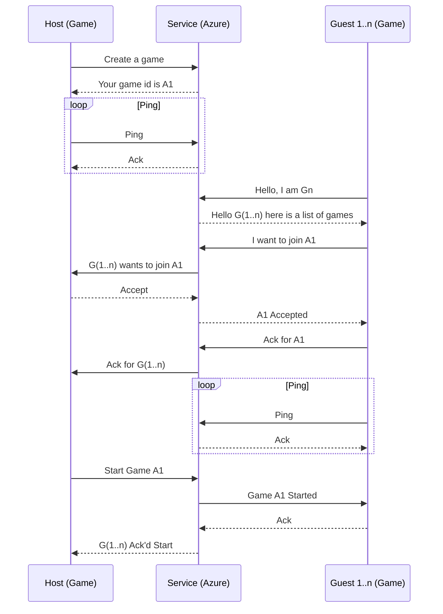
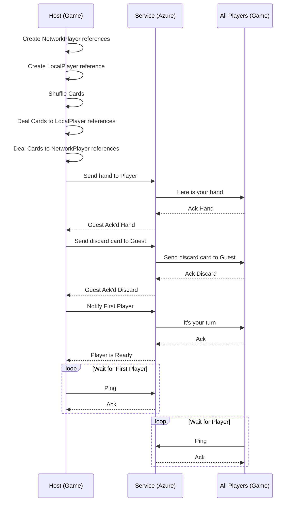
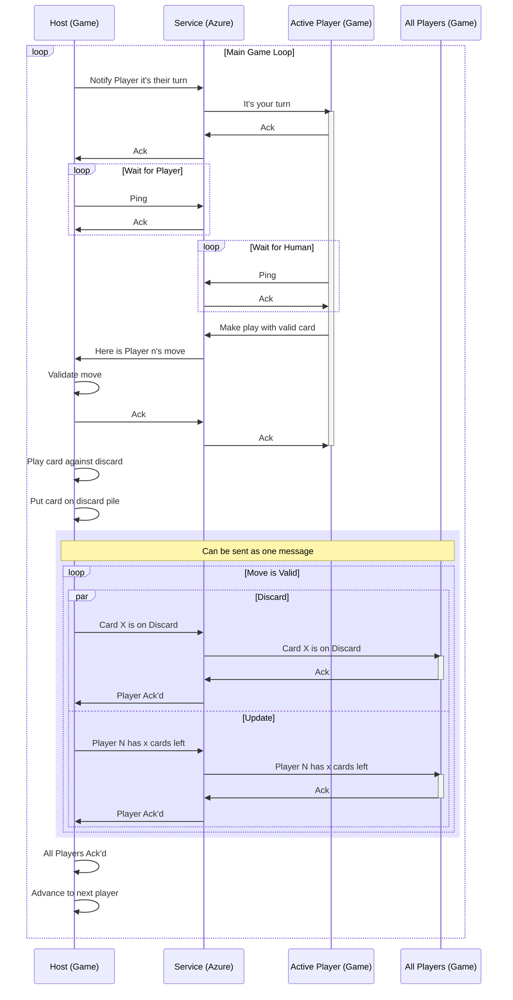
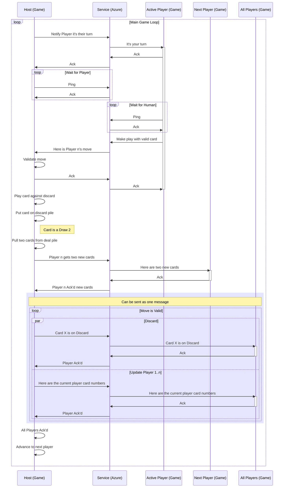

# Commands
To facilitate the sequences below we will have the following commands

## Host
Commands that the host will use to broadcast messages to each client.

  * SendCards - Can be 1 or more cards for the player to accept as part of their hand
  * SendAction - Will tell a player the last action played to update the game status (started, playing, skipped, won, score)
  * UpdatePlayers - Will send the correct number of cards for each player
  * SendDiscard - Will send the current discard along with the number of cards on the stack
  * SendDeal - Will send the current number of cards on the deal deck so the player will see a proper representation on their screen

## Client
Messages from the client to the host

  * SendCards - Can be 1 or more cards for the host to validate against the discard pile
  * DrawCard - Can be a special card used in the previous method to tell the host to give a card

# Lobby / Game Creation

The game creation will work on a model where the host tells the game service it's ready to host a game. The service will keep a reference to the host and list the game publicly or privately so any number of guests up to n can join.

# Start Game Play Sequence

Once the players are connected the host will shuffle and deal the deck to the players. The lobby portion of the host will pass along the connection information to the Game scene.

# Player Makes Simple Move

After the game has started we will continuously ping the server as a keep alive. We will also accept messages from the player. The game state is completely managed on the host so we need to be ready for any player to try and make a move at any time. This is why we need to have Send/Ack messages to guarantee no one gets out of sync. This is the sequence for a card leaving a player's hand with no other interactions.

# Player Makes Move that affects other players

This is a game with a winner after all. If the player plays something like a Draw 2 it will cause the other player adjacent to them to have to get two new cards. This is similar to when a card is dealt.

